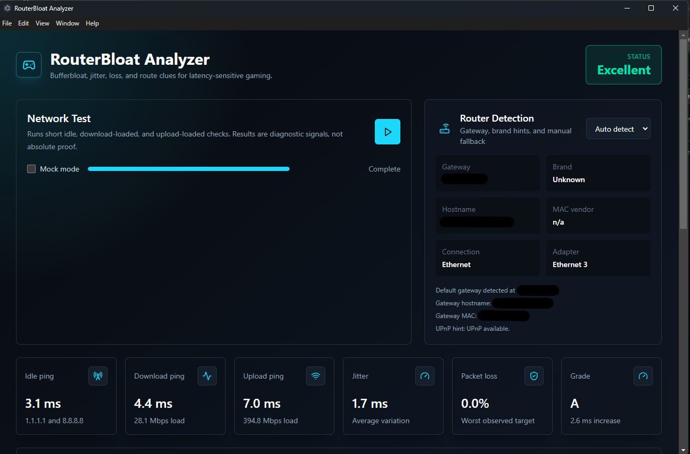

# RouterBloat Analyzer

RouterBloat Analyzer is a Windows-first desktop app for gamers who want to understand whether lag is coming from their local network, router, ISP, or a specific game route.

It runs short latency and load checks, compares idle and loaded ping, detects the local gateway, and turns the results into plain-English guidance instead of scary false certainty.

## Features

- Bufferbloat test with idle, download-loaded, and upload-loaded latency using parallel load streams
- Light, medium, and heavy load profile grades so results are easier to relate to real use
- Separate estimated download and upload speed test
- Packet loss, jitter, max latency, and latency-increase scoring
- A-F bufferbloat grade
- Local router and default gateway detection
- Active adapter detection for Ethernet, Wi-Fi, virtual, or unknown links
- Router-brand-aware recommendations for OpenWrt, ASUS, TP-Link, Netgear, Eero, and generic routers
- Gaming Route Test for a game server IP or hostname
- Copyable report with test results, diagnosis, and recommended next steps

## Screenshots



## Tech Stack

- Electron
- React
- Vite
- TypeScript
- Tailwind CSS
- Node.js `child_process.execFile` for sanitized Windows networking commands

## Requirements

- Windows 10 or Windows 11
- Node.js 20 or newer recommended
- npm

The MVP is Windows-first and uses commands such as `ipconfig`, `ping`, `arp`, `nslookup`, and PowerShell networking cmdlets. Admin access is not required.

## Getting Started

Install dependencies:

```powershell
npm install
```

Run the app in development:

```powershell
npm run dev
```

Build the app:

```powershell
npm run build
```

Build a local Windows installer and portable app:

```powershell
npm run dist
```

Run the built Electron app:

```powershell
npm start
```

The packaged installer and portable executable are written to `release/`.

## Installing From GitHub

Download the latest Windows installer directly:

[Download RouterBloat Analyzer for Windows](https://github.com/anthony-baker87/routerbloat-analyzer/releases/latest/download/RouterBloat-Analyzer-Setup.exe)

If you want a portable version that runs without installing:

[Download the portable version](https://github.com/anthony-baker87/routerbloat-analyzer/releases/latest/download/RouterBloat-Analyzer-Portable.exe)

You can also open the repository's **Releases** page and download the latest files from **Assets**.

You can ignore files such as `.blockmap`, `latest.yml`, `builder-debug.yml`, and source code archives unless you are debugging or developing the app.

Because this app is not code-signed yet, Windows SmartScreen may show a warning the first time you run it. Choose **More info** and **Run anyway** only if you downloaded it from the official repository release.

## Publishing A Release

This repo includes a GitHub Actions workflow that builds the Windows installer automatically when you push a version tag.

```powershell
git add .
git commit -m "Prepare Windows release build"
git push origin main

git tag vX.Y.Z
git push origin vX.Y.Z
```

GitHub Actions will build the app and attach the installer artifacts to the tagged release.

## Using The App

Click the play button in the Network Test panel to run diagnostics. The app performs short download and upload load tests, so avoid running it during an active competitive match.

For route-specific issues, enter a game server IP or hostname in **Gaming Route Test**. The app compares:

- Router/default gateway
- Cloudflare DNS, `1.1.1.1`
- Google DNS, `8.8.8.8`
- Your game server target

The route result is labeled as likely `Local`, `ISP`, `Game Route`, or `Inconclusive`.

## Scoring

Bufferbloat grade is based on loaded latency increase:

| Grade | Loaded latency increase |
| --- | --- |
| A | Under 20 ms |
| B | 20-50 ms |
| C | 50-100 ms |
| D | 100-200 ms |
| F | Over 200 ms |

## Project Structure

```text
electron/
  diagnostics/
    commands.ts          # Safe command execution wrapper
    diagnosis.ts         # Plain-English diagnosis rules
    gateway.ts           # Gateway, adapter, router detection
    loadTest.ts          # Short download/upload load checks
    ping.ts              # Windows ping parser and summaries
    recommendations.ts   # Router-specific recommendation engine
    routeTest.ts         # Gaming route comparison test
    testRunner.ts        # Main bufferbloat test orchestration
    types.ts             # Electron-side shared types
  main.ts                # Electron main process and IPC
  preload.cjs            # CommonJS preload bridge for Electron
  preload.ts             # TypeScript preload source
src/
  App.tsx                # React dashboard
  main.tsx               # Renderer entry
  main.css               # Tailwind entry and global styles
  types.ts               # Renderer-side shared types
scripts/
  copy-preload.cjs       # Copies preload.cjs into dist-electron
```

## Safety Notes

Networking commands are executed with `execFile`, not shell string interpolation. User-entered route targets are validated before being passed to `ping`.

The separate download/upload speed numbers use an Ookla-compatible speed test package when available, with a generic HTTPS fallback if that test fails. Bufferbloat profile grades still come from RouterBloat Analyzer's own load-and-ping checks.

This tool is diagnostic, not definitive. Network behavior can vary by time of day, server location, Wi-Fi conditions, ISP congestion, and game-server routing.

## Roadmap Ideas

- Game-specific server presets
- Optional `tracert` view for route hops
- Packaged installer builds
- Historical test comparison
- Export report to Markdown or JSON
- Better router vendor detection through a richer OUI database

## License

MIT
